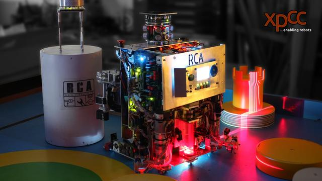

# Why use xpcc?

<center>

</center>

xpcc is tailored for the harsh requirements of the [Eurobot competition][eurobot],
where our robots need to run reliably and completely autonomously for the games
duration. Furthermore, our robots started off running on AVRs, so xpcc also
needs to be very efficient with its resources to be able to support these tiny
microcontrollers.
All in all, this means we need a really robust and safe foundation to build all
our code upon.

This foundation is xpcc.
It runs very reliably and efficiently on AVR as well as ARM Cortex-M cores.
Here are the reasons why.

## Data-driven design

The most unique thing about xpcc is how we generate our hardware abstraction
layer (HAL) drivers.
We have assembled the unique meta data of all of our targets, such as number
and type of peripherals, pins, memories and interrupts.
This way we know which devices are similar to each other even before opening the
datasheet, and we can make informed decisions about what HAL drivers an entire
*family* of devices requires, rather than going through this cumbersome process
for each device individually.

This dramatically reduces duplicated code, required a lot less porting effort
and leads to much higher device coverage of our HAL drivers.
By combining the specific device meta data with our driver templates, we
collect the similarities and differences between device families in one common
place, which makes it so much easier to reason about them.

This extract from the [STM32F407 device file][stm32f407] shows
several types of peripheral drivers as well as additional information like
instances and pin alternate functions:
```xml
...
<driver type="adc" name="stm32" instances="1,2,3"/>
<driver type="clock" name="stm32"/>
<driver type="i2c" name="stm32" instances="1,2,3"/>
<driver type="uart" name="stm32" instances="1,2,3,4,5,6"/>
<driver type="gpio" name="stm32">
  <gpio port="A" id="0">
    <af id="1" peripheral="Timer2" name="Channel1"/>
    <af id="8" peripheral="Uart4" name="Tx" type="out"/>
    <af peripheral="Adc1" name="Channel0" type="analog"/>
  </gpio>
  ...
```

This information is then passed to our [HAL drivers][hal_drivers], which use
code generation tools, specifically the [Jinja2 template engine][jinja2], to
generate the appropriate C++ code structures for the specified target:
<markdeep-diagram>
                              .           :          .        :
                              |     .------------.   |     .------.
                              +--->| ADC Template |  +--->| GpioB2 |
                              |     '------------'   |     '------'
 .------.      .-----------.  |     .-------------.  |     .------.
| Target +--->| Device File +-+--->| GPIO Template +-+--->| GpioB3 |
 '------'      '-----------'  |     '-------------'  |     '------'
                              |     .------------.   |     .------.
                              +--->| I2C Template +  +--->| GpioB4 |
                              |     '------------'   |     '------'
                              '           :          '        :
</markdeep-diagram>

This treasure trove of information is available for [every AVR and STM32
device][device_files] we support and gives us a high confidence
in the quality of our HAL ports.


## Usable & fast C++

xpcc's APIs are kept simple and fast by splitting up functionality into
separate, small, static functions, which implement the same behavior on all
platforms.
Furthermore, with our code generation capabilities, we can hide the crazy
implementation details of the hardware without compromising on performance.

For example, on different AVRs, simple things like enabling the internal PullUp resistor,
dealing with external interrupts or even just toggling a pin is done quite dissimilarly.
Yet, using static inlined functions we can call GPIO functions at [*ludicrous speed*][ludicrous],
all without using even a single byte of static RAM:
```cpp
using Led = GpioOutputB1;   // Generated by GPIO HAL driver using meta-data.
Led::setOutput();           // Sets the pin to output on any platform.
Led::set();                 // Literally 1 instruction on AVR.
Led::toggle();              // PORTA ^= 0x02;  or  PINA = 0x02;  if available.

using Button = GpioInputA0; // All pins behave the same way.
Button::setInput(Gpio::InputType::PullUp);  // PORTA |= 0x01;  or  PUEA |= 0x01;
bool state = Button::read();                // (PINA & 0x01)  or
Button::setInputTrigger(Gpio::InputTrigger::RisingEdge);  // Don't panic!
Button::enableExternalInterrupt();          // Something, something, EIMSK.
Button::acknowledgeExternalInterruptFlag(); // don't worry, we will do it!
```

You can use these GPIOs as building blocks for more complex drivers and
peripherals and still maintain access speed without sacrificing usability:
```cpp
// Create a hardware accelerated port of 4 bit width.
using Port4 = GpioPort< GpioC0, 4 >;        // MSB -> C3, C2, C1, C0 <- LSB
using ReadWrite = GpioC4;                   // "name" your GPIOs.
using Reset = GpioOutputC5;
using Enable = GpioOutputC6;

// Build a super fast character display driver using these inlined GPIOs.
xpcc::Hd44780<Port4, ReadWrite, Reset, Enable> display;
display.initialize();   // driver knows to initialize for a 4 bit bus!
display << "Hello World!" << xpcc::endl;    // Yes, ostreams. Deal with it.
```

All other HAL drivers are build using these principles, which makes them easy
to configure and use yet very fast without consuming a lot of resources.

## Static allocation

Nowhere in our HAL do we allocate memory dynamically – everything is either
statically allocated or must explicitly be allocated by the user.
This is a strong requirement to be able to run xpcc on AVRs, which have
little if any memory to spare for dynamic allocations.

We took great care to make sure this constraint remains usable, starting with
configurable queue sizes for buffered UART to providing statically extensible
I2C state machine for custom IC drivers.
When we allocate static memory, we choose an appropriate size for its purpose.
After all, just because you *can* use `int` doesn't mean you *should*.

We transparently show you how much static memory your application is using,
so you get an idea of how much certain functionality costs you in resources.
This is the size of the accelerometer example on the STM32F3 discovery board:
```sh
cd examples/stm32f3_discovery/accelerometer
scons
[...]
Memory Usage
------------
Device: stm32f303vc

Program:    5188 bytes (2.0% used)
(.data + .reset + .rodata + .text)

Data:       3092 bytes (6.3% used) = 852 bytes static (1.7%) + 2240 bytes stack (4.6%)
(.bss + .data + .noinit + .stack)

Heap:      38352 bytes (78.0% available)
(.heap1)
```

## Compile-time assertions

xpcc stands out for its extensive use of static C++ classes and templates which
is unusual in this field, but lends itself well to the static nature of
embedded development.
By combining modern C++11 features like `constexpr` functions with the meta-data
inside our HAL drivers, we can add additional type checks and move certain
computations into compile-time, with obvious speed and usability improvements.

As an example, consider how xpcc connects GPIOs to peripherals and computes
baudrates at compile time[^baud]:
```cpp
// The specific UART connect type is unique to this GPIO.
GpioA2::connect(Uart0::Tx);
GpioA3::connect(Uart0::Rx, Gpio::InputType::PullUp);
// Connecting a type to the wrong GPIO will simply _not compile_!
GpioA0::connect(Uart0::Tx); ⚡   // PA0 does not have this alternate function!

// Enforce the UART baudrate with a 1% tolerance, otherwise compilation error!
Uart0::initialize<systemClock, 115200>();   // prescalers computed at compile-time
```

By moving these checks into compile time, xpcc can prevent predictable failures
before the code ever makes it to the target, and remove the need for expensive
computations at runtime altogether, which pays off especially on AVRs!
Another interesting side effect is that your code *is* your documentation, with
its correctness transparently enforced at compile-time.

[^baud]: [Computing and Asserting Baudrate Settings at Compile Time](http://blog.xpcc.io/2015/06/08/computing-and-asserting-baudrate-settings-at-compile-time/)

## Multitasking

xpcc uses stackless cooperative multitasking, for which we have ported
[protothreads][] to C++ and extended them with [resumable functions][resumable].
This enables you to split up your application into separate tasks, and use
synchronous APIs in all of them, without sacrificing overall responsiveness.
This works on even the most resource restricted AVRs, since each task only
requires 2 bytes!

All our IC drivers are implemented using resumable functions, which can be
called from within protothreads or explicitly blocking outside of them.
Here is an example of [reading out the accelerometer][accel]:
```cpp
class ReaderThread : public xpcc::pt::Protothread
{
public:
    bool run()
    {
        PT_BEGIN();
        // The driver does several I2C transfer here to initialize and configure the
        // external sensor. The CPU is free to do other things while this happens though.
        PT_CALL(accelerometer.configure(accelerometer.Scale::G2));

        while (true)    // this feels quite similar to regular threads
        {
            // this resumable function will defer execution back to other protothreads
            PT_CALL(accelerometer.readAcceleration());

            // smooth out the acceleration data a little bit
            averageX.update(accelerometer.getData().getX());
            averageY.update(accelerometer.getData().getY());

            // set the boards LEDs depending on the acceleration values
            LedUp::set(   averageX.getValue() < -0.2);
            LedDown::set( averageX.getValue() >  0.2);
            LedLeft::set( averageY.getValue() < -0.2);
            LedRight::set(averageY.getValue() >  0.2);

            // defer back to other protothreads until the timer fires
            PT_WAIT_UNTIL(timer.execute());
        }
        PT_END();
    }
private:
    // This accelerometer is connected via I2C.
    xpcc::Lis3dsh< xpcc::Lis3TransportI2c< I2cMaster > > accelerometer;
    xpcc::PeriodicTimer timer = xpcc::PeriodicTimer(5); // 5ms periodic timer.
    xpcc::filter::MovingAverage<float, 25> averageX;
    xpcc::filter::MovingAverage<float, 25> averageY;
};
ReaderThread reader;    // Protothread is statically allocated!

int main() // Execution entry point.
{
    while(true)
    {   // the main loop with implicit round robin cooperative scheduling.
        reader.run();
        otherProtothreads.run();
    }
}
```


[accel]: https://github.com/roboterclubaachen/xpcc/blob/develop/examples/stm32f4_discovery/accelerometer/main.cpp
[resumable]: http://xpcc.io/api/group__resumable.html#details
[protothreads]: http://xpcc.io/api/group__protothread.html#details
[hal_drivers]: https://github.com/roboterclubaachen/xpcc/tree/develop/src/xpcc/architecture/platform/driver
[ludicrous]: https://www.youtube.com/watch?v=ygE01sOhzz0
[device_files]: https://github.com/roboterclubaachen/xpcc/tree/develop/src/xpcc/architecture/platform/devices
[jinja2]: http://jinja.pocoo.org
[stm32f407]: https://github.com/roboterclubaachen/xpcc/blob/develop/src/xpcc/architecture/platform/devices/stm32/stm32f405_407_415_417-i_o_r_v_z-e_g.xml
[eurobot]: http://www.eurobot.org/
