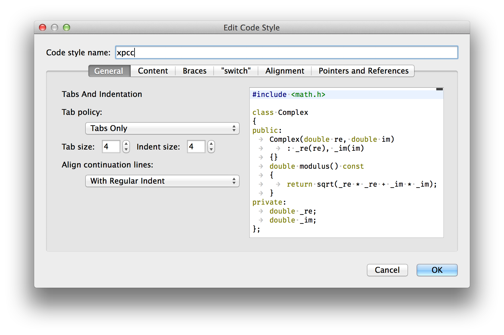
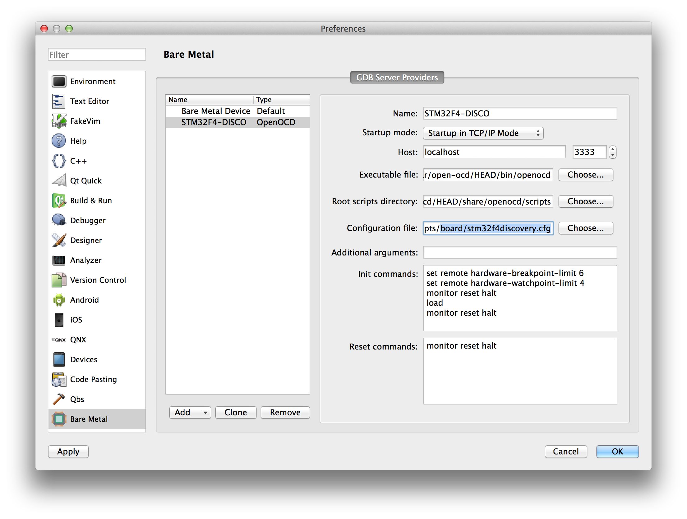
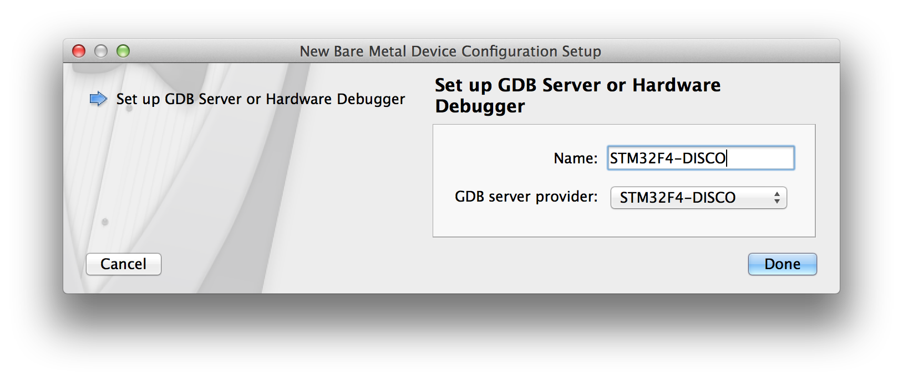
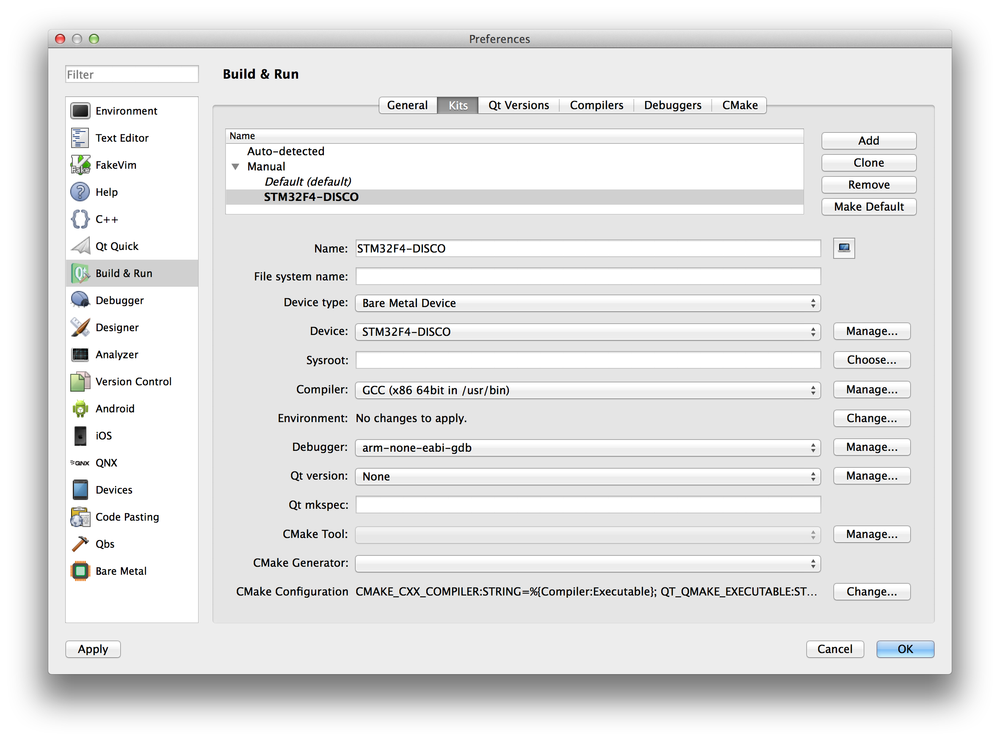
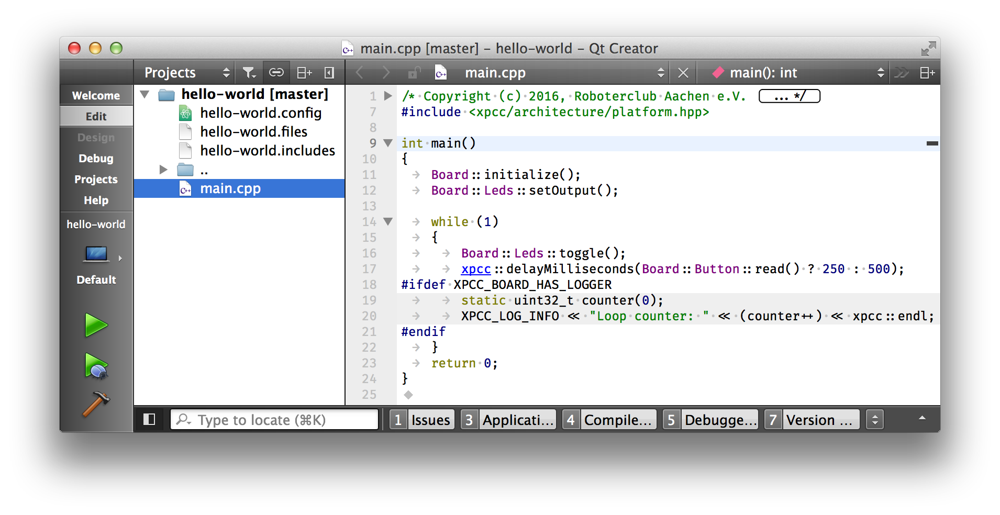
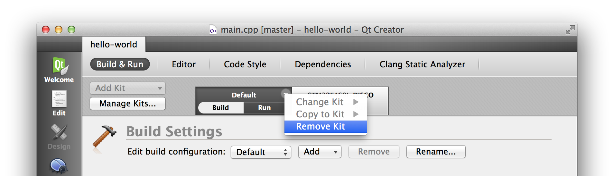

Make sure you have gone through the [Installation guide](http://xpcc.io/installation/) so you have the necessary toolchain installed.

# Qt Creator integration

This tutorial shows how to adapt the Qt Creator IDE for comfortable developing and debugging of xpcc projects on STM32 microcontrollers.

This tutorial uses xpcc’s `hello-world` example project of [our `getting-started-with-xpcc` repository](https://github.com/roboterclubaachen/getting-started-with-xpcc) for the STM32F4 Discovery board.

## Installation

Install [Qt Creator version 4.0 or above](https://www.qt.io/ide/).

```
# On Fedora 22 and up
sudo dnf install qtcreator
# On Ubuntu 16.04
sudo apt-get install qtcreator
# On OS X
brew cask install qtcreator
```

## Global setup

### Enable Bare Metal plugin

OS X: *Qt Creator* → *About Plugins...*  
Linux: *Help* → *About Plugins...*

<center></center>

Enable the BareMetal plugin and restart Qt Creator.

### Code Style

OS X: *Qt Creator* → *Preferences...*  
Linux: Go to *Options* dialog: *Tools* → *Options...*

Go to Tab *C++*, create a copy of the `Qt [builtin]` code style, name it `xpcc` and click *Edit...*.
<center></center>
Set *Tab policy* to `Tabs only`, save and exit.

### Add debugger

Refer to the [Installation guide](http://xpcc.io/installation/) on how to install the arm-none-eabi toolchain.

In *Build & Run* and sub-tab *Debuggers* click *Add* to add the `arm-none-eabi-gdb` debugger to Qt Creator:
<center></center>
Qt Creator requires the debugger to support Python scripting.

If you use the precompiled [arm-none-eabi toolchain from ARM](https://developer.arm.com/open-source/gnu-toolchain/gnu-rm/downloads) you need to use `arm-none-eabi-gdb-py` here!

For Linux distributions that ship the toolchain themselves and have Python scripting enabled by default, you can use `/usr/bin/arm-none-eabi-gdb` (without the `-py`).

### Add OpenOCD server

If you have not installed OpenOCD yet, do so now:

```
# On Fedora 22 and up
sudo dnf install openocd
# On Ubuntu 16.04
sudo apt-get install openocd
# On OS X
brew install openocd --HEAD
```

Go to tab *Bare Metal* and select *Add* → *OpenOCD*.
<!-- <center></center> -->
<center></center>

Use the following settings:

- Startup mode: *Startup in TCP/IP Mode*
- Executable file: Path to OpenOCD binary: `/usr/local/bin/openocd` (OS X), or `/usr/bin/openocd` (Linux)
- Root scripts directory: Absolute path to OpenOCD script directory: `/usr/local/share/openocd/scripts` (OS X), or `/usr/share/openocd/scripts` (Linux)
- Configuration File: `board/stm32f4discovery.cfg`, do not worry if the text field turns red.

If you want to use other targets, create an *OpenOCD provider*, *Device* and *Kit* for each or them.
Have a look at the OpenOCD script directory to find a configuration file for your target.

### Add target device

For the next step go to the *Devices* tab and *Add...* a new *Bare Metal Device*.
<!-- <center></center> -->
Use the following settings:
<center></center>
Again, go to tab *Build & Run*, sub-tab *Kits* and click *Add* to add a new so called Kit.
<center></center>

- Device type: *Bare Metal Device*
- Device: *STM32F4-DISCO* (the device we just created)
- Compiler: Irrelevant, we won't use it.
- Debugger: *arm-none-eabi-gdb*
- Qt version: *None*

Click *Ok*.

## xpcc project setup

Check out the getting started repository:
```sh
git clone --recursive https://github.com/roboterclubaachen/getting-started-with-xpcc.git
```

Change to the project folder and run `scons qtcreator` to generate the Qt creator project files for the xpcc project:
```sh
cd getting-started-with-xpcc/hello-world
scons
scons qtcreator

scons: Reading SConscript files ...
scons: done reading SConscript files.
scons: Building targets ...
Template: 'getting-started-with-xpcc/xpcc/templates/qtcreator/project.creator.in' to 'hello-world.creator'
Template: 'getting-started-with-xpcc/xpcc/templates/qtcreator/project.config.in' to 'hello-world.config'
Template: 'getting-started-with-xpcc/xpcc/templates/qtcreator/project.files.in' to 'hello-world.files'
Template: 'getting-started-with-xpcc/xpcc/templates/qtcreator/project.includes.in' to 'hello-world.includes'
scons: done building targets.
```

Open project with Qt Creator: *File* → *Open File or Project*
<center></center>
<center></center>
Select the *Projects* view from the *Mode Selector* on the left side (*Window* → *Show Mode Selector* if not visible).

First, click *Add Kit* → *STM32F4-DISCO*, then remove the created *Default* using the icon to the right of it: *Default* → *Remove Kit*.
<center></center>

Next go to the *Build Settings* and remove all existing *Build Steps* and *Clean Steps* and:

- add a new *Custom Process Step* build step with command `scons` and argument `program`.
- add a new *Custom Process Step* clean step with command `scons` and argument `-c`.
- add a custom `PATH` to the *System Environment*, if you need to.

<center></center>
Switch to *Run Settings* and select *Run on GDB server or hardware debugger* as *Run Configuration*. Select the **.elf*-file as executable.
<center></center>

Congratulations, you can now compile, program and debug your xpcc application comfortably in Qt Creator.
